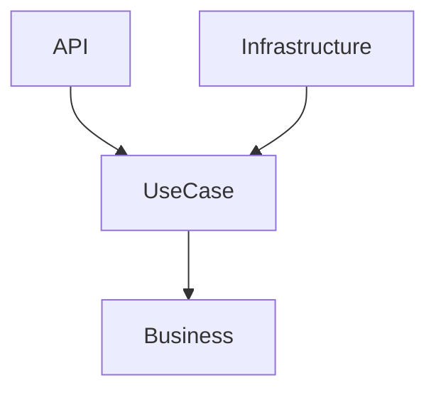

# House Broker

**House Broker** is a real estate listing and management application built with Clean Architecture principles. It supports broker and seeker workflows, property listing CRUD, search and filtering, commission calculation, caching, and unit testing.

## Assessment Coverage

- User authenticatin with ASP.NET Identity and authorize attribute for RBAC.
- Broker and seeker role differentiation
- CRUD operations for property listings
- Search and filtering by location, price range, and property type
- Commission engine with configurable rates stored in the database
- Commission visibility restricted to the broker owner
- API endpoints for third-party use
- Caching for commission configuration
- Unit tests for commission logic, listing usecases

## Features

- Create and manage property listings with detailed attributes
- Search listings by location, price range, and property type
- Commission calculation based on configurable rules
- Listing owner commission visibility
- Clean separation of concerns via layered architecture
- API documentation available via Scalar

## Technology Stack

- .NET 10 / ASP.NET Core Web API
- Clean Architecture with Domain, Application, Infrastructure, API layers
- Entity Framework Core with SQL Server
- ASP.NET Identity
- FluentValidation
- nUnit, Moq
- Caching and logging

## Getting Started

### Prerequisites

- [.NET 10 SDK](https://dotnet.microsoft.com/en-us/download/dotnet/10.0)
- SQL Server
- Visual Studio, Visual Studio Code, or Rider

### Installation

1. Clone the repository:

   ```bash
   git clone https://github.com/pragmasujit/fluffy-blue.git
   cd fluffy-blue/src/HouseBroker
   ```

2. Update `appsettings.json` with a valid SQL Server connection string:

   ```json
   "DefaultConnection": "Server=.;Database=HouseBrokerDb;Trusted_Connection=True;"
   ```

3. Apply migrations:

   ```bash
   dotnet ef database update --project ../HouseBroker.Infrastructure
   ```

4. Run the application:

   ```bash
   dotnet run
   ```

5. Scalar documentation:

   ```text
   http://localhost:5114/scalar/
   ```

### Seed Data

- Default broker user:
  - username: `user`
  - password: `User@123`

## API Endpoints

- Authentication endpoints login
- Listing endpoints for create, read, update, and delete
- Search endpoint with filters:
  - `location`
  - `minPrice` / `maxPrice`
  - `propertyType`
- Commission data stored on each listing and returned only to the broker owner

## Commission Logic

Commission rates are configurable in the database and used by the commission engine:

- price < 5,000,000 → 2%
- 5,000,000 <= price <= 10,000,000 → 1.75%
- price > 10,000,000 → 1.5%

Commission is calculated, stored on each listing, and shown only to the broker who owns the listing.

## Testing

Run unit tests:

```bash
dotnet test
```

Covered tests include:

- Commission logic
- Listing service logic
- Controller tests with mocked dependencies

## Notes

- Does not implement token based authentication; uses cookie based.
- Caching is implemented by CommissionProvider and through CommissionEngine.
- Does not implement api standardization.
- Uses ASP.NET Identity with role-based broker and seeker handling.
- Commission rates are seeded during migration, see HouseBroker.Infrastructure/EntityConfigurations.
- Unit of work is implemented through shared object to prevent abstraction leak.
- Caching is used for commission configuration.
- Integration tests are out of scope for this MVP.
- Repositories expose explicit query methods to maintain clear separation of read and write concerns and to support CQRS consistency.
- Subject is implemented directly at UseCase layer using POCO to mitigate IDOR and to allow testability. 



## Clean Architecture

- Presentation (Api/Infrastructure same precedence) used for exposing and ingress. 
- UseCase, Used for Business logic facade and sourcing external dependency through interface adapter.
- Business, Used purely for business modelling/POCO.
